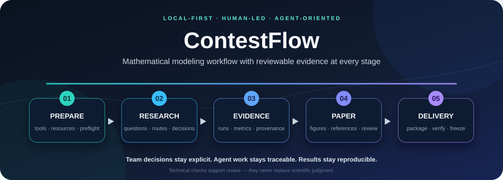

<div align="center">



<p><strong>把读题、建模、实验、论文与交付连接成一条可审查、可复现的证据链。</strong></p>

<p>
  
  
  
  
  <a href="https://github.com/whjwjx/ContestFlow/stargazers"></a>
</p>

<p>
  <a href="#核心能力">核心能力</a> ·
  <a href="#从一次团队协作开始">协作方式</a> ·
  <a href="#快速开始安装与导入材料">快速开始</a> ·
  <a href="#文档与开发">文档</a>
</p>

</div>

ContestFlow 是一个**团队主导、面向 Agent 的数模竞赛工作流与可复现工具包**。团队负责理解题意、选择模型、安排实验、解释证据并审定提交；Agent 在已授权的阶段内辅助分析、编程、实验和文字整理；本地工具负责保存来源、运行记录与产物身份。

> [!IMPORTANT]
> “全流程”指覆盖比赛各阶段的协作与核验，并不表示一次运行就能完成建模论证或直接提交。CLI 不调用 LLM，也不上传比赛平台。当前为 `0.2.0a1` 实验版本，不同赛题、规则和本机环境请以预检及真实运行结果为准。

## 核心能力

<table>
  <tr>
    <td width="50%" valign="top">
      <strong>🧭 分阶段的人机协作</strong><br>
      把团队决定、Agent 建议和自动检查分开记录。已有授权可以连续执行，关键研究判断仍由团队掌握。
    </td>
    <td width="50%" valign="top">
      <strong>🧪 可复现的实验与证据</strong><br>
      记录输入、代码、参数、环境、指标和失败尝试；上游改变后，旧证据会被识别为过期。
    </td>
  </tr>
  <tr>
    <td width="50%" valign="top">
      <strong>🧰 可复用的赛前能力</strong><br>
      发现非默认目录中的工具，管理绘图与配色资源，用固定小样例检查科学计算、文档和交付环境。
    </td>
    <td width="50%" valign="top">
      <strong>📦 从论文到候选包的核验</strong><br>
      用同一正文源构建 HTML/PDF，绑定图表与证据，检查实际 ZIP、包内复现结果和冻结字节。
    </td>
  </tr>
</table>

仓库由轻量 [Agent skill](skills/contestflow/SKILL.md)、按阶段读取的指南、可复用资源和本地 CLI 组成。skill 帮助 Agent 判断范围并调用工具，CLI 提供可核验的工程操作；安装与宿主适配见 [skill 使用说明](docs/agent-skill.md)。

## 从一次团队协作开始

在本项目打开 AI 任务，给出题面和附件路径：

> 按 AGENTS.md 启动这次比赛。赛题在 `<路径>`，截止时间是 `<时间和时区>`。先整理读题包：题目要求、约束、评价口径、材料缺口、候选路线和需要团队决定的问题。我们确认方向与预算后，再在授权阶段内连续辅助实现、实验和整理，每阶段给出证据、局限与待审事项。

默认启动先完成材料导入和读题包，供团队讨论。团队已有的决定和阶段授权可以继续使用，无需对每条命令重复确认。路线、假设或预算发生实质变化时，应回到对应的团队判断点。

| 阶段 | 团队主要判断 | AI 辅助与可审阅成果 |
|---|---|---|
| 赛前准备 | 选择本次工具、呈现方式和所需能力 | 资源复用、环境发现、小样例检查和流程预演 |
| 读题与选题 | 小问理解、约束、评价口径与任务取舍 | 材料索引、逐问要求表、歧义和待决策清单 |
| 建模与计划 | 模型假设、方法适用性、实验预算与停止条件 | 候选路线、文献依据、推导草稿与可行性比较 |
| 实现与实验 | 基线是否合理、验证是否充分、是否继续投入 | 核心代码、合法性检查、可复现实验与失败记录 |
| 结果与解释 | 结论是否被证据支持、局限是否充分 | 对比底表、图表候选、敏感性分析与解释草稿 |
| 论文与审阅 | 论证、表述、图表和真实 AI 使用说明 | 正文整理、证据引用、构建与一致性检查 |
| 交付与提交 | 审定最终内容、核对规则、决定提交 | 候选文件、实际包复现与冻结记录 |

阶段之间可以回退和迭代。`plan` / `next` 根据已有文件推荐技术上的下一步，同时提示团队需要判断的事项；它们不会自动确认团队已经审阅。

例如，团队讨论完成后可以继续发出简短指令：

> 采用路线 B，先验证假设 H1，实验限时 30 分钟。请在这个阶段内连续完成基线与对比，保留失败记录，结束后汇报证据和待审结论。

## 快速开始：安装与导入材料

AI 应按[入口规范](AGENTS.md)建立独立工作区。也可手动启动材料导入：

```powershell
python -m venv .venv
.\.venv\Scripts\python -m pip install -e ".[science,documents,dev]"
.\.venv\Scripts\contestflow start workspaces/my-contest --materials "D:\path\to\problems" --title "我的比赛"
```

需要 Python 3.11 或以上。Linux/macOS 使用 `.venv/bin/python` 和 `.venv/bin/contestflow`。核心命令不依赖科学计算包，`science` 供示例与绘图，`documents` 供 PDF 读取和 Pandoc。生成 PDF 还需系统安装 XeLaTeX 及所用字体。

接下来让 AI 读取生成的 `workspaces/my-contest/AGENTS.md` 与 `docs/AI_TASK.md`，整理读题包。既有比赛不会被重新初始化覆盖；原件按哈希复制，导入代码不执行。

升级工具后，已有工作区的 `AGENTS.md` 不会自动更新。请阅读并合并新版协作原则，再用 `contestflow plan <工作区>` 刷新生成的 `docs/AI_TASK.md`；团队决定等已有记录应保留，无需重新 `init` 旧工作区。

## 复用资源与赛前准备

先用 [资源库](docs/resources.md) 保存工具来源、用途、依赖和配色定义，再按本次选择进行 [环境预检](docs/preflight.md)。资源可以跨比赛复用，本机安装路径单独保存在忽略的本机配置中。

~~~powershell
.\.venv\Scripts\contestflow doctor
.\.venv\Scripts\contestflow resources workspaces/my-contest --select tool.numpy tool.matplotlib palette.project-p7
.\.venv\Scripts\contestflow preflight workspaces/my-contest --profile full-html --level rehearsal --output .contestflow/preflight/first-rehearsal
~~~

`doctor` 只盘点；`preflight` 支持盘点、实际小样例验证和独立合成流程演练。已选择的资源自动加入所需检查，未选择的 GPU 等能力不算缺项。完整 PDF 演练可使用 `full-pdf`；生成的图、文档仍需实际打开审阅。检查结果明确区分通过、失败、缺失、未验证和本次不需要。

工具定位先用明确配置，再查当前环境、PATH、包内工具和有限的补充目录。非默认安装可用 `contestflow tools --set pandoc "D:\My Tools\Pandoc\pandoc.exe"` 记住；失效配置会报告原因，多个补充候选会列出供选择，不静默改换版本。预检和论文构建共用定位逻辑。

## 用教学示例了解工具链

```powershell
.\.venv\Scripts\contestflow doctor
.\.venv\Scripts\contestflow demo workspaces/demo-assignment --example assignment --format html --allow-exec
.\.venv\Scripts\contestflow demo workspaces/demo-forecast --example forecast --format html --allow-exec
```

`demo` 连续执行预先写好的教学题、算法、指标和报告模板，用来演示从实验到候选包的技术链路。真实比赛中的问题理解、模型选择、论证和团队审阅仍需逐项完成；演示成功不证明工具能独立解答新赛题。

优化示例使用 SciPy 求解分配问题，并以小规模枚举独立核对；预测示例使用 NumPy 拟合线性趋势，按时间划分训练与留出数据。示例不构成竞赛成果或真实泛化验证。数据配方、固定 seed 与来源边界见 [示例来源说明](docs/example-provenance.md)。

演示结束后查看：

| 内容 | 工作区内路径 |
|---|---|
| 当前协作任务与阶段建议 | `docs/AI_TASK.md`、`contestflow next <工作区>` |
| 原始输入、代码版本和失败记录 | `runs/<实验>/<运行>/record.json` 与日志 |
| 指标定义与可重算底表 | `evidence/metrics.json`、`comparison.csv` |
| 可离线打开的图型/配色/表格选择页 | `reviews/index.html` |
| 唯一正文源与生成报告 | `paper/draft.md`、`paper/build/paper.html` |
| 实际 ZIP 与校验结果 | `deliverables/candidate.json`、`verification.json` |

浏览器导出的选择文件用 `contestflow select <工作区> <figure-selection.json>` 导入；重新构建论文后生成新候选包。默认样式会明确记为 `automatic-default`。图表样式的选择仅说明呈现偏好，不能代替对数字与解释的审阅。

## 工作流命令

所有命令都可加 `--help`；路径参数允许绝对或相对路径。

```text
contestflow init PATH [--example assignment|forecast]
contestflow start PATH --materials SOURCE
contestflow intake PATH --materials SOURCE
contestflow plan PATH
contestflow next PATH
contestflow status PATH
contestflow run PATH --allow-exec [--workers 2] [--force]
contestflow compare PATH
contestflow charts PATH
contestflow select PATH SELECTION.json
contestflow paper PATH --format html|pdf
contestflow package PATH
contestflow verify PATH [--smoke --allow-exec]
contestflow freeze PATH --confirm
```

`run` 默认复用指纹及产物哈希均一致的成功记录；输入、源码、声明的包版本或参数变化后重新运行。失败、超时和旧尝试保留。先审查配置，再授予 `--allow-exec`；运行器不是安全沙箱。

`package` 只复制允许清单；`verify --smoke` 从实际 ZIP 解压后运行配置的复现例。`freeze` 只冻结字节，不表示团队已经审定或平台提交成功，且默认不生成平台 MD5。冻结后必须创建新版本才能继续修改。

## 论文、图表与真实使用记录

Markdown 支持 `{{metric:实验ID:指标名}}`、`{{table:comparison}}` 和 `{{figures}}`，构建时从有效底表替换。未运行成功、证据过期、未知指标或 `TODO` 占位会阻止构建。团队仍须核对手写数字、数学推导、文献来源和结论适用范围；自动检查只覆盖已实现的规则。

论文采用 [受限 Markdown/Bib 与图片规则](docs/paper-resources.md)：正文图片仅使用 `paper/figures/` 内的 PNG/JPEG，外部资源、原始 HTML/TeX、SVG 和自定义宏需要转换或改写后使用。此限制同时用于 HTML 与 PDF。

中文 PDF 在 `contest.json` 的 `paper.cjk_font` 填已安装字体名，规则优先于个人偏好。PDF/HTML 共享正文，版式仍需分别检查。图表提供两种适合标量比较的图型、默认三套配色，另可选择资源库中的 P6/P7 子集或自定义配色及两种表格样式；复杂流程图、分布和配对分析需按题目另行实现，并说明数据依据。

AI 参与了路线建议、核心代码、分析或保留文本时，应按实际使用与当届规则记录和披露。团队主导描述的是决策与核验责任，不能据此淡化 AI 已经完成的工作。工具不预填未经核实的模型名、版本发布日期或人工审阅结论。

## 参与与反馈

ContestFlow 仍在 Alpha 阶段，欢迎把真实使用中遇到的问题和可复用经验带回来：

- 遇到错误、环境兼容问题或流程断点，请[提交 Issue](https://github.com/whjwjx/ContestFlow/issues/new)，附上最小复现、系统与 Python 版本；不要上传私有题面、凭据或队伍信息。
- 想增加题型适配器、工具资源、检查规则或文档，请先阅读[贡献规范](CONTRIBUTING.md)，让新增能力带有公开的小样例、测试和适用边界。
- 如果这个项目帮你减少了环境排查、实验追踪或交付核验的成本，欢迎给仓库一个 [Star](https://github.com/whjwjx/ContestFlow/stargazers)，让更多需要这类工作流的人找到它。

## 文档与开发

- [团队协作与 AI 辅助边界](AGENTS.md)
- [Agent skill 安装与分工](docs/agent-skill.md)
- [Alpha 发布检查](docs/releasing.md)
- [架构与协议](docs/architecture.md)
- [扩展赛题适配器](docs/adapter-guide.md)
- [安全与公开边界](SECURITY.md)
- [路线图与验证记录](docs/roadmap.md)
- [贡献规范](CONTRIBUTING.md)

```powershell
.\.venv\Scripts\python -m pytest -q
.\.venv\Scripts\python -m ruff check src tests scripts
.\.venv\Scripts\python -m build
```

核心与示例代码采用 MIT 许可证。输入题面、第三方数据、字体、论文模板、官方评测器不因使用本工具自动获得再分发许可。仓库默认忽略 `workspaces/`；公开或分享文件前仍需检查实际内容。
